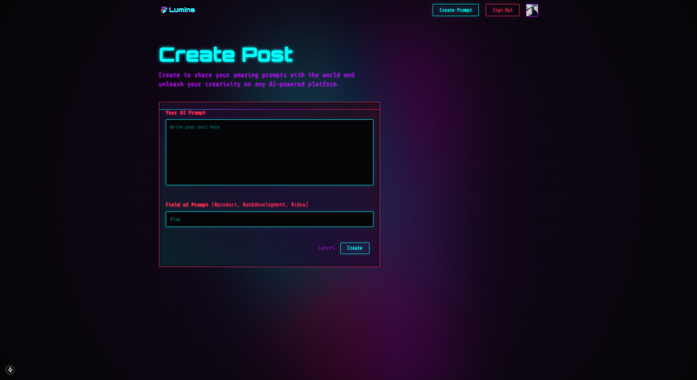

# Lumina: A Platform for Creative Exploration

Lumina is a platform for sharing and exploring AI prompts, encouraging creativity and collaboration among users. Discover the power of AI-generated content and unlock your creative potential with Lumina.

## 🚀 Features

- Share and discover AI prompts
- Collaborate with other creators
- Explore AI-generated content
- User authentication and profiles
- Responsive and modern UI

## 🛠️ Tech Stack

- **Framework**: Next.js
- **Authentication**: NextAuth.js
- **Database**: MongoDB
- **Styling**: Tailwind CSS
- **State Management**: React Hooks
- **Deployment**: Vercel

## 🏁 Getting Started

### Prerequisites

- Node.js (v14 or higher)
- pnpm (or npm/yarn)
- MongoDB database

### Installation

1. Clone the repository:

   ```bash
   git clone https://github.com/AvishkaGihan/lumina-prompt-platform.git
   cd lumina-prompt-platform
   ```

2. Install dependencies:

   ```bash
   pnpm install
   # or
   npm install
   # or
   yarn install
   ```

3. Set up environment variables:
   Create a `.env` file in the root directory and add:
   ```env
   NEXTAUTH_URL=http://localhost:3000
   NEXTAUTH_SECRET=your-nextauth-secret
   GOOGLE_ID=your-google-client-id
   GOOGLE_CLIENT_SECRET=your-google-client-secret
   MONGODB_URI=your-mongodb-uri
   ```

### Development

Start the development server:

```bash
pnpm dev
# or
npm run dev
# or
yarn dev
```

Open [http://localhost:3000](http://localhost:3000) in your browser to see the result.

### Production

Build the project:

```bash
pnpm build
# or
npm run build
# or
yarn build
```

Start the production server:

```bash
pnpm start
# or
npm start
# or
yarn start
```

## 📁 Project Structure

```
lumina-prompt-platform/
├── app/                    # Next.js app directory
│   ├── api/               # API routes
│   ├── create-prompt/
│   ├── profile/
│   ├── update-prompt/
│   ├── layout.jsx         # Root layout
│   └── create-prompt/     # Create prompt page
├── components/            # Reusable UI components
├── models/               # MongoDB models
├── public/              # Static assets
├── styles/              # Global styles
├── utils/               # Utility functions
├── .env                 # Environment variables
├── .gitignore
├── next.config.mjs      # Next.js configuration
├── package.json         # Project dependencies
├── pnpm-lock.yaml      # Lock file
├── postcss.config.mjs   # PostCSS configuration
└── tailwind.config.js   # Tailwind CSS configuration
```

## 📚 Key Files and Directories

- `app/`: Contains the main application components and pages
- `components/`: Reusable UI components
- `models/`: Mongoose models for MongoDB
- `utils/`: Utility functions and helpers
- `styles/`: Global and component-specific styles

## 📖 Learn More

- [Next.js Documentation](https://nextjs.org/docs) - Learn about Next.js features and API
- [Learn Next.js](https://nextjs.org/learn) - Interactive Next.js tutorial
- [Next.js GitHub Repository](https://github.com/vercel/next.js)

## 🚀 Deployment

The easiest way to deploy your Next.js app is to use the [Vercel Platform](https://vercel.com/new) from the creators of Next.js. Check out the [Next.js deployment documentation](https://nextjs.org/docs/deployment) for more details.

## 📝 License

This project is licensed under the MIT License - see the [LICENSE](LICENSE) file for details.

## 👥 Contributing

Contributions are welcome! Please feel free to submit a Pull Request.

1. Fork the repository
2. Create your feature branch (`git checkout -b feature/AmazingFeature`)
3. Commit your changes (`git commit -m 'Add some AmazingFeature'`)
4. Push to the branch (`git push origin feature/AmazingFeature`)
5. Open a Pull Request

## 📸 Screenshots

### Home Page


_Description: Overview of the home page featuring the prompt feed and navigation._

### Profile Page


_Description: User profile page showing created prompts and user information._

### Create Post Page


_Description: Interface for creating new AI prompts with tag selection and prompt input._

## 🎉 Acknowledgments

- Next.js team for the amazing framework
- Vercel for the deployment platform
- MongoDB for the database solution
- All contributors who help improve the platform
